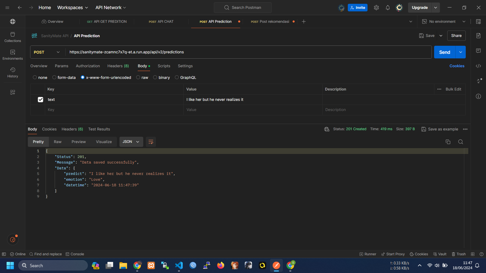
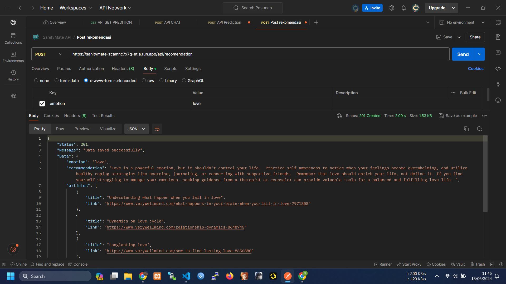

# Capstone Project

## Overview

This project is a recommendation system built using Node.js for the Capstone Project. It utilizes machine learning capabilities, HTTP requests, and interacts with a MySQL database to provide recommendations and predictions based on user input.

## Installation

1. Clone the repository.
2. Install dependencies with `npm install`.

## Usage

### Endpoints

#### POST Requests:

- **Create Prediction**:

  - Endpoint: `http://localhost:3000/api/v2/predictions`
  - Payload: JSON object with `text`.
  - Description: Creates a prediction for the given input text using a machine learning model. The predicted emotion along with the input text and timestamp are stored in the MySQL database.

- **Create Prediction (With Gemini Ai)**:

  - Endpoint: `http://localhost:3000/api/predictions`
  - Payload: JSON object with `predictions`.
  - Description: Creates a prediction for the given input using a legacy prediction module. The predicted emotion along with the input text and timestamp are stored in the MySQL database.

- **Create Recommendation**:

  - Endpoint: `http://localhost:3000/api/recomendation`
  - Payload: JSON object with `emotion`.
  - Description: Creates a recommendation based on the provided emotion. The recommendation, relevant links, and timestamp are stored in the MySQL database.

- **Generate Chat Response**:
  - Endpoint: `http://localhost:3000/api/chat`
  - Payload: JSON object with `chat`.
  - Description: Generates a chat response based on the input chat message. The generated response, along with the input message and timestamp, are returned.

#### GET Requests:

- **Get Predictions**:

  - Endpoint: `http://localhost:3000/predictions`
  - Query Parameter: `emotion` (optional) - Filter predictions by emotion.
  - Description: Retrieves all predictions from the MySQL database. Optionally filters predictions by emotion.

- **Get Recommendations**:
  - Endpoint: `http://localhost:3000/recomendations`
  - Query Parameter: `emotion` (optional) - Filter recommendations by emotion.
  - Description: Retrieves all recommendations from the MySQL database. Optionally filters recommendations by emotion.

## Development

- Run the server with `npm run start`.
- The server will run on `http://localhost:3000`.

## Docker Usage

To build and run the application using Docker, follow these steps:

```sh
# Build the Docker image
docker build -t sanitymate .

# Tag the Docker image
docker tag sanitymate:latest gcr.io/project-capstone-syaidandhika/sanitymate:latest

# Push the Docker image to Google Container Registry (GCR)
docker push gcr.io/project-capstone-syaidandhika/sanitymate:latest

# Deploy the Docker image to Google Cloud Run
gcloud run deploy sanitymate \
--image gcr.io/project-capstone-syaidandhika/sanitymate:latest \
--platform managed \
--region asia-southeast2 \
--allow-unauthenticated
```

## Dependencies

- [@hapi/hapi](https://www.npmjs.com/package/@hapi/hapi): For building the server.
- [@tensorflow/tfjs](https://www.npmjs.com/package/@tensorflow/tfjs): For machine learning capabilities.
- [axios](https://www.npmjs.com/package/axios): For making HTTP requests.
- [dotenv](https://www.npmjs.com/package/dotenv): For loading environment variables.
- [moment-timezone](https://www.npmjs.com/package/moment-timezone): For handling timezones.
- [@google-cloud/firestore](https://www.npmjs.com/package/@google-cloud/firestore): For interacting with Firebase services.
- [nodemon](https://www.npmjs.com/package/nodemon): For automatic server restarts during development.

## Testing

Here are some images to illustrate the prediction and recommendation results:

### Prediction



### Recommendation


